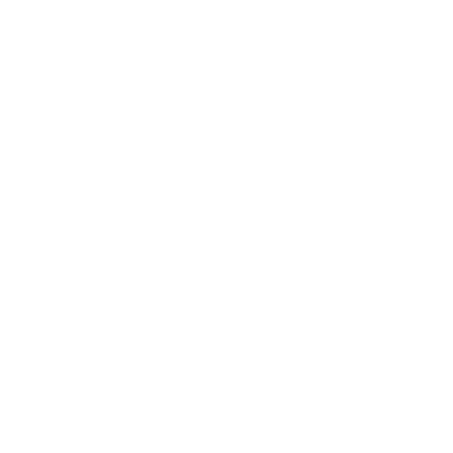

# 🎄 Advent of Code 2023

<!--- advent_readme_stars table --->
## 2023 Results

| Day | Solution | Part 1 | Part 2 |
| :---: | :---: | :---: | :---: |
| [Day 1](https://adventofcode.com/2023/day/1) | [d1.cpp](d1/d1.cpp) | ⭐ | ⭐ |
| [Day 2](https://adventofcode.com/2023/day/2) | [d2.cpp](d2/d2.cpp) | ⭐ | ⭐ |
| [Day 3](https://adventofcode.com/2023/day/3) | [d3.cpp](d3/d3.cpp) | ⭐ |   |
| [Day 4](https://adventofcode.com/2023/day/4) | [d4.cpp](d4/d4.cpp) | ⭐ | ⭐ |
| [Day 5](https://adventofcode.com/2023/day/5) | [d5.cpp](d5/d5.cpp) | ⭐ |   |
<!--- advent_readme_stars table --->

## Fun Comments
I'm doing this year of advent of code in C++, feel free to come along for the ride.

